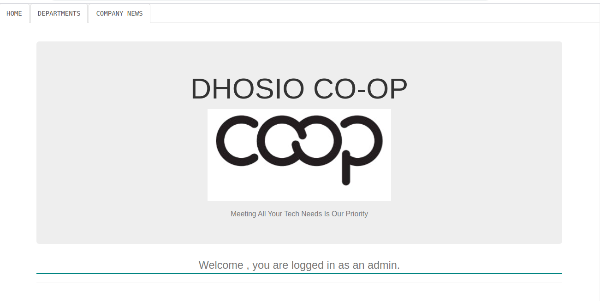

# DHOISO CO-OP NEWS PORTAL

 This project was generated with [Angular CLI](https://github.com/angular/angular-cli) version 9.0.7.

 Created By: Daniel Githiomi
 
 Visit [MyTrello](https://trello.com/b/GhxGOAFL/organisational-news-portal) to see what my app can do

## Screenshots

  

## Description

Create a rest REST API for querying and retrieving scoped news and information. There should be news/articles/posts that are available to all employees without navigating into any department, and others that are housed/classified within departments.

## Setup/Installation Requirements
* i5 Core
* 6GB RAM
* 1TB Internal storage 

## Compatibility

  Compatible with all browsers.
  further updates on the way. 

## Technologies Used
It is made completely using sublime Text 3 where all the following files were created and modified until the output is as you see it.
* HTML 5
* CSS, Bootstrap
* Java
* JQuery
* Heroku
* Groovy
* Maven

## Known Bugs
No bugs to report at the moment! the system works efficiently at 100% guaranteed. Feel free to search the output on googl to ensure that it coincides exactly.

## Link to live page
No live link available.
However, the Repo link is: [Click-Here](https://github.com/githiomi/NewsPortal)

## Setup Instructions
* git clone [This](https://github.com/githiomi/NewsPortal) into your terminal.  
* Open the folder in your favourite editor, for example IntelliJ.
* Set up your local database. (A database file has been created for you!)
* In your terminal go to the directory src/main/resources/database then run 'psql < create.sql'
* At your root directory, run the 'App' in your browser using 'gradle run'.
* Enjoy the Dhosio Co-Op app.

## Support and contact details
Contact me through any of the following:
* Slack: danielgithiomi
* Email: danielgithiomi@gmail.com

### License
Click the following to access the license page: [Click-Here] (https://github.com/githiomi/license/blob/master/LICENSE)

Copyright (c) {2020} Dhosio Co.
